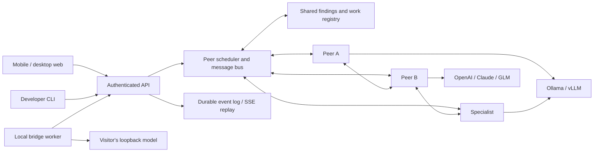

# Architecture and orchestration contract

## Separation of models and agents

A provider record is an endpoint + exact model ID + transport + encrypted credential. An agent is an identity with a model connection, role, task, inbox, latest findings, and turn history. Several agents may use one provider. A run’s selected provider pool governs delegation; agents cannot silently consume other saved cloud connections.

The scheduler grants turns and enforces resources. It does not act as a reasoning coordinator. Initial peer identities have no special authority. `parentId` records who created an agent; `reportsTo` is a voluntary, changeable relationship and confers no privileged tools.

## Streaming peer protocol

Public Markdown can contain fenced `council` JSON blocks. Each complete block is validated and executed while streaming. Invalid/incomplete blocks do not execute. Maximum output bytes, control blocks, calls, agents, concurrent calls, depth, and wall time bound the work. Only selected pool providers are allowed for specialist creation.

Supported fields:

- `messages`: legacy direct or broadcast engagement; delivered to the next model turn.
- `broadcasts`: durable posts and replies on the shared board.
- `conversations`: two-peer threads, versioned proposals, explicit reviews and optional joint publication.
- `tasks`: work delegated to an existing peer, without forcing a permanent hierarchy.
- `delegates`: invite specialists on the same or another selected model.
- `organization`: choose a role and optional reporting relationship.
- `work`: claim a stable work key or mark an owned item complete.
- `findings`: publish a stable claim key with explicit supporting evidence.
- `disputes`: challenge a finding and propose a targeted recheck.
- `revisions`: revise a finding with new evidence; previous acceptances expire.
- `acceptances`: evidence-based acceptance of an exact finding revision.
- `proposal`: propose a complete final answer and rationale.
- `review`: endorse or challenge an exact candidate-answer ID.
- `tools`: board/thread history, virtual file proposals, and (when the user enables it) real hosted project reads/writes/commands.

Structured findings and work registries are shared to avoid repeated investigations. This is not a semantic-equivalence engine: differently named duplicate work can still occur. Provider reasoning is displayed but not copied into peer prompts. Public findings and board messages are shared. Direct-thread bodies are included only for participants; the user can inspect all of them.

## Completion and persistence

A final candidate needs explicit endorsement from all participating peers, no open finding disputes or unresolved conversation proposals, no uncompleted work claims, and no pending task/challenge/tool-result mail. Endorsement is evidence of agreement, not proof of correctness. A run that cannot satisfy these conditions within its budget is `needs_review`; it receives a qualified answer with outstanding objections and can be continued with saved state.

SQLite stores users, sessions, provider metadata, encrypted secrets, runs, events, workspace files, proposals, and saved team preferences. SSE IDs are durable and scoped by run ownership. Disconnecting the browser does not stop the run. Stop aborts active provider requests. A process restart marks running work interrupted; restart recovery is not transparent continuation of an in-flight model request.

The current deployment is one Node process. The active scheduler and bridge queues are in memory; SQLite persists sessions and history. Multi-instance operation needs an external queue, durable worker leases, shared event delivery, and a server database. Do not run multiple workers against the same SQLite file expecting coordinated scheduling.

## Source map

| File                     | Responsibility                                                                           |
| ------------------------ | ---------------------------------------------------------------------------------------- |
| `server/orchestrator.ts` | Peer scheduling, stream commands, messaging, dynamic organization, consensus and budgets |
| `server/knowledge.ts`    | Shared findings, dispute revisions and work ownership                                    |
| `server/providers.ts`    | Ollama, Responses, Messages, compatible streaming protocols and demo                     |
| `server/bridge.ts`       | Outbound local worker jobs and streamed replies                                          |
| `server/app.ts`          | Auth, account scoping, run/settings/file/bridge APIs                                     |
| `server/security.ts`     | Password hashing, token hashing, encryption, endpoint validation                         |
| `server/store.ts`        | Durable events, run persistence and restart marking                                      |
| `src/App.tsx`            | Responsive workspace, activity, findings, connections and team settings                  |
| `cli/index.ts`           | Login, run/watch/stop and local bridge worker                                            |

## Verification boundaries

Unit/integration/browser tests use scripted or protocol fixture outputs. They can prove routing, state transitions, input validation and rendered interaction, not that real models understand the goal or resolve a substantive disagreement correctly. A useful next acceptance exercise is one small local model with five agents, then the same fixed task with three different model families, comparing final claims to independent ground truth.

## Native coding runtime

`cli/opencode.ts` pins a loopback runtime and a locally chosen project, maps each run/peer to a persistent native session, forwards public messages and bounded tool/diff activity, and aborts owned sessions on cancellation. The hosted bridge routes permission/question responses only to active jobs belonging to the signed-in user. Responses remain queued until acknowledged. OpenCode credentials stay local. Native inner-loop model calls are distinct from Council turn budgets. See [Coding](CODING.md) for isolation, concurrent-edit and recovery limits.

## Hosted project broker

`server/sandbox.ts` reaches `deploy/sandbox-broker.mjs` over a permission-limited
Unix socket. The app derives the owner from authenticated identity, never the
request body. The broker maps that owner to a fixed container and accepts only
bounded operations. It rejects overlapping operations on a project; the agent
scheduler additionally serializes tool calls. Optimistic SHA checks catch edits
between read and write. The app blocks manual writes while the account has an
active council. Broker sessions are ephemeral, never part of SQLite backups.

See [Coding](CODING.md) for exact resource limits, expiration, export restrictions
and the remaining gaps with a native OpenCode workspace. Real Docker integration
checks run in CI before deployment; they are separate from model benchmarks.

## Standalone native runtime

`bin/council.mjs` resolves Council's own TypeScript runtime from the installation,
so `council` can launch in any project directory. `cli/native.ts` owns a local
Store and Orchestrator with a per-project SQLite history, encrypted provider
keys and process lock. `cli/project.ts` implements the injected ProjectRuntime
interface for real file/search/patch/diff/command operations. No HTTP account
or OpenCode process participates. `cli/tui.ts` provides terminal views, model
selection, approval prompts, session replay/resume and a small built-in editor.

The same orchestration engine retains board/direct conversations, evidence and
adaptive delegation. Project operations serialize across peers, and edits use
content hashes. The web server does not instantiate LocalProject: its hosted
tools continue to use the restricted Docker broker. This prevents a native CLI
feature from silently enabling arbitrary application-host file access.

Native config/history and hosted accounts are separate. The OpenCode adapter
remains an optional compatibility path; its own capabilities are not evidence
of native Council parity. See [native operation](NATIVE.md) and the
[capability table](CODING.md#capability-status).
