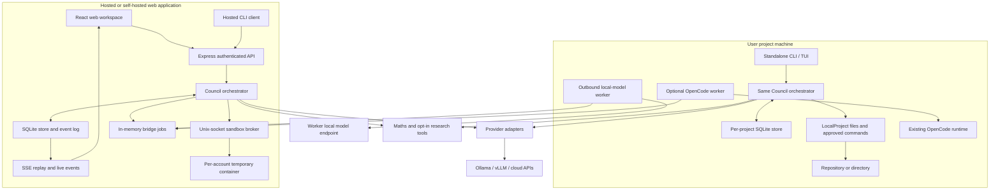
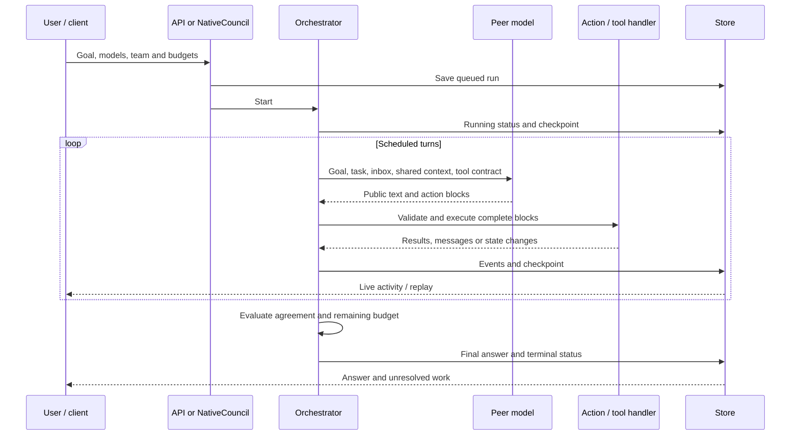
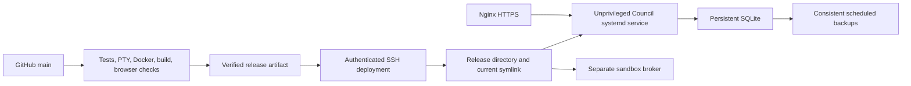

# Council of AI architecture

**Version:** **0.2.6 candidate source**, updated **2026-09-23**. Builds on the
0.2.5 baseline (`ef0a1da`); release approval/deployment must be verified separately.
This document describes that implementation, followed by a
separate extension plan. It does not claim that every installation is running
that revision or that Council has reached full OpenCode parity.

The [documentation index](README.md) links the owner-confirmed development and
business plans. Staging, daily allowances, paid credits, BYOK activation,
native desktop apps and PostgreSQL remain future work. See
[known issues](KNOWN_ISSUES.md) for candidate-review recovery defects.

Council is an independent multi-model work harness. It combines a peer
collaboration engine, model connections, tools, durable sessions, a responsive
web workspace, and a standalone CLI/TUI. OpenCode is an optional adapter, not a
dependency of Council's own coding runtime.

## Contents

- [1. Product contract and capabilities](#1-product-contract-and-capabilities)
- [2. System layout and execution modes](#2-system-layout-and-execution-modes)
- [3. Domain model and storage](#3-domain-model-and-storage)
- [4. Run lifecycle and scheduling](#4-run-lifecycle-and-scheduling)
- [5. Communication and action protocol](#5-communication-and-action-protocol)
- [6. Evidence and adaptive delegation](#6-evidence-and-adaptive-delegation)
- [7. Answers, failures and continuation](#7-answers-failures-and-continuation)
- [8. Providers and bridges](#8-providers-and-bridges)
- [9. Tools and project runtimes](#9-tools-and-project-runtimes)
- [10. Web research](#10-web-research)
- [11. User interfaces and API](#11-user-interfaces-and-api)
- [12. Security and data boundaries](#12-security-and-data-boundaries)
- [13. Deployment, upgrades and scaling](#13-deployment-upgrades-and-scaling)
- [14. Validation and failure lessons](#14-validation-and-failure-lessons)
- [15. Planned LSP, MCP and skills](#15-planned-lsp-mcp-and-skills)
- [16. Decisions and open work](#16-decisions-and-open-work)
- [17. Source map and maintenance](#17-source-map-and-maintenance)

## 1. Product contract and capabilities

The intended product is a team that can solve a goal together, including working
on an entire coding project. Every peer can report evidence, ask another peer a
question, delegate work, challenge a conclusion or propose an answer. Roles and
voluntary reporting relationships can change. There is no permanent reasoning
leader, but the harness still enforces permissions, validation and budgets.
Organizational freedom does not authorize a model to change those controls.

| Capability                                                    | Status at this baseline                                             |
| ------------------------------------------------------------- | ------------------------------------------------------------------- |
| Desktop/mobile web                                            | Responsive browser application; not native mobile/desktop apps      |
| Standalone CLI/TUI                                            | Implemented; no account, web server or OpenCode required            |
| Local/cloud model pool, independent agent count               | Implemented                                                         |
| Broadcast board and direct conversations                      | Implemented with next-turn delivery                                 |
| Delegation, roles and changeable reporting                    | Implemented within resource limits                                  |
| Findings, disagreements and work ownership                    | Implemented using stable keys and revisions                         |
| Evidence-based expertise assessment                           | Implemented within a run/continuation, not global learned rankings  |
| Native multi-file coding                                      | File tools, approved commands, basic editor and history             |
| Hosted coding                                                 | Opt-in temporary, isolated, networkless Node workspace              |
| Exact maths                                                   | Arithmetic, bounded factorization and linear systems                |
| Web research                                                  | Off by default; public page reads and selected OpenAI-backed search |
| LSP                                                           | Native stdio diagnostics/navigation; hosted integration pending     |
| MCP                                                           | **Planned; not implemented**                                        |
| Agent Skills / `SKILL.md` loading                             | Native project Skills discovery and paged loading                   |
| Interactive slash-command picker                              | **Planned**; typed slash commands work                              |
| Persistent hosted repositories, embedded web PTY, rich editor | **Unfinished**                                                      |
| Proven superiority over a single model                        | **Not established**                                                 |

Reading `AGENTS.md` project instructions and recording peer “skill assessments”
are existing features distinct from native Agent Skills loading. More agents
are an experiment in collaboration, not a guarantee of better answers. See the
[coding capability ledger](CODING.md#capability-status).

## 2. System layout and execution modes

**Standalone native:** `bin/council.mjs` loads Council's own runtime.
`NativeCouncil` constructs a local Store, Orchestrator and LocalProject. It works
in an existing repository or ordinary directory. Its `local-operator` identity
is a storage namespace, not a network login. Cloud models are optional. With
local models, research disabled and no externally communicating commands, work
can remain on that machine.

**Web/server:** one Node process serves the frontend, authenticated API,
scheduler, provider streams and event subscriptions. Real project operations go
through a separate broker; the app does not instantiate LocalProject against its
application directory. Mobile browsers use the same API and orchestration.

**Hosted CLI:** login/run/watch/stop commands use the server account. This is
separate from the account-free native TUI. Native settings and history do not
automatically synchronize with hosted accounts.

**Bridges:** outbound workers let hosted councils reach models on other machines.
A separate optional coding worker connects an existing OpenCode runtime. Neither
is a general inbound filesystem API to the user's computer.

Stack: TypeScript, Node.js >=22.18, Express 5, React 19, Vite, Zod and Node's
`node:sqlite`. Production serves built frontend assets and runs backend
TypeScript through `tsx`. There is no external message broker or vector database.

## 3. Domain model and storage

| Entity                  | Meaning and persistence                                                                                                 |
| ----------------------- | ----------------------------------------------------------------------------------------------------------------------- |
| User                    | Hosted account, name, email and password hash in `users`                                                                |
| Login session           | Hashed cookie/bearer token, owner, expiry and kind in `sessions`                                                        |
| Provider                | Connection ID, endpoint, exact model ID, transport and encrypted credential in `providers`                              |
| Member/peer             | Agent identity, provider ID, role, parent/depth/reporting relation; saved in run checkpoints                            |
| Run                     | Goal, config, status, final answer, parent link and shared checkpoint; JSON in `runs`                                   |
| CouncilEvent            | Database ID, run ID, time, event type and JSON payload in `events`                                                      |
| Finding                 | Stable key, claim, evidence strings, revision, author, challenges and acceptances in shared state                       |
| Work                    | Stable key, owner, description, claimed/complete state and result in shared state                                       |
| Board/conversation      | Broadcast posts and two-peer threads with proposal revisions in shared state                                            |
| Assessment              | Domain-specific peer observation tied to exact finding revisions in shared state                                        |
| Answer candidate        | Current answer and reviews in memory; events persist for display, but continuation does not restore an active candidate |
| Team preferences        | Account's saved RunConfig in `preferences`                                                                              |
| Virtual files/proposals | Account-scoped text and proposed edits in `files` / `proposals`, separate from real projects                            |
| Benchmark report        | Suite metadata and trial results as JSON in `benchmarks`                                                                |

Several agents can use one provider: five agents do not need five model-weight
copies. Five models can also serve ten agents. Initial assignments are chosen or
distributed; specialists can select only from the run's selected provider pool.

SQLite uses WAL, foreign keys and a busy timeout. Events are inserted before
notifying subscribers. Run checkpoints and event rows are saved separately:
this is checkpoint-plus-event persistence, not transactional event sourcing or
an exactly-once workflow engine.

Server state defaults to installation-local `.council/`, overridden by `DATA_DIR`.
Native model metadata defaults to `~/.config/council/native-models.json`; project
state defaults to `~/.local/share/council/projects/<path-hash>/`. The resolved
project path determines the namespace. Native state includes a database, vault
key, process lock and file-recovery directory. See [NATIVE.md](NATIVE.md) for
configuration overrides.

Only saved credentials are vault-encrypted. Goals, events, conversations and
virtual files are ordinary database contents protected by filesystem/account
controls, not whole-database encryption.

## 4. Run lifecycle and scheduling

Admission checks ownership, selected providers and limits. Demo and real
providers cannot share a run. Hosted admission allows one active council or
benchmark per account and up to ten active council runs globally. Native mode
uses a per-project process lock to avoid competing local Council processes.

The scheduler maintains a peer map, deduplicated queue and active promises in
memory. It starts eligible peers up to configured concurrency; one peer cannot
have overlapping turns. Messages and tool results enqueue recipients. Project
operations have an additional serial queue even when model calls overlap.

Each model request is reconstructed from the goal, task, inbox, bounded peer
contributions, shared knowledge, communication context, assessments and current
candidate. It does not resend an unlimited transcript. Provider-returned
reasoning is emitted for display and excluded from peer prompts.

| Resource                      | Current limit / behavior                                             |
| ----------------------------- | -------------------------------------------------------------------- |
| Selected providers            | 1–20                                                                 |
| Starting agents               | 1–32                                                                 |
| Total agents                  | Configurable up to 128, or `null` for no fixed cap                   |
| Spawn depth                   | 0–16, or `null` for no fixed cap                                     |
| Concurrent Council turns      | 1–8; default 1                                                       |
| Calls per run                 | Up to 256; default 24, with sufficient starting-turn budget required |
| Ordinary model output tokens  | 256–16,384; default 4,096                                            |
| Wall time                     | 1–120 minutes; default 20                                            |
| Checkpointed inbox            | Last 40 messages per peer                                            |
| Default communication context | Last 20 board posts and last 12 messages per participating thread    |
| Shared registries             | 40 findings, 60 work items, 100 assessments                          |

Free delegation removes fixed count/depth caps, not call/time/output/action
limits. Normally one call is reserved for qualified synthesis. Web searches
consume the shared call budget. OpenCode's optional inner-loop calls are not
individually limited by Council's outer call budget.

Several turns without new evidence, tool output, completed work or candidate
review trigger a request for a concrete check/blocker. At `max(8, peerCount × 3)`
stagnant turns, after active turns finish, the engine ends discussion and attempts
qualified synthesis. This is a heuristic: repeated low-value results/reviews can
still count as progress. It is not a semantic proof of useful work.

## 5. Communication and action protocol

**Board:** all peers, including new specialists, see shared broadcasts and replies.
`read_board` retrieves older pages. Math results and web evidence are posted for
reuse without requiring every peer to repeat the call.

**Direct threads:** two peers exchange messages, propose a joint summary with
evidence, review its exact revision, and publish to the board only after both
agree. Others see thread metadata; the user can inspect every body.
`read_conversation` checks participation. This is prompt routing, not end-to-end
confidentiality: participants may restate content publicly and the host stores it.

**Timing:** actions route as complete blocks arrive and the UI streams events.
A running model request still has a fixed input. New mail is consumed on the
next turn. Real-time activity does not mean modifying model input mid-generation
or exposing private internal reasoning. Public contributions and provider-returned
reasoning/summaries are distinct outputs.

Models emit Markdown plus fenced `council` JSON. Zod validates the entire block
before execution. Malformed blocks execute none of their actions and return
repair feedback. Previously executed valid blocks are not rolled back. Actions
inside a valid block can succeed/fail individually; execution is not transactional.

| Action family                                      | Purpose                                                      |
| -------------------------------------------------- | ------------------------------------------------------------ |
| `broadcasts`, `messages`, `conversations`          | Board posts, legacy routing and two-peer threads             |
| `tasks`, `delegates`                               | Assign work to an existing peer or invite a specialist       |
| `organization`                                     | Change own role and voluntary reporting relationship         |
| `work`, `reassignments`                            | Claim, complete or transfer owned work                       |
| `findings`, `disputes`, `revisions`, `acceptances` | Shared claims and revision-specific disagreements            |
| `assessments`                                      | Evidence-linked observations of peer/domain performance      |
| `tools`                                            | Request maths, research, virtual files or project operations |
| `proposal`, `review`                               | Submit or review the current answer candidate                |

Tools return results to the requesting peer's next-turn inbox. Prompts require
waiting for actual output rather than inventing it in the same response. The
parser/dispatcher currently lives inside `server/orchestrator.ts`; there is no
general plugin tool registry yet.

## 6. Evidence and adaptive delegation

Stable keys normalize case/whitespace. Publishing an existing finding key returns
its existing record. A repeated work claim returns its owner or completed result.
This deduplicates keys, not meanings: equivalent checks under different keys can
still repeat.

A newly published finding is internally `established` immediately. This means an
uncontested recorded claim, **not verified truth**. Its evidence strings are
agent-supplied. Actual tool output provides stronger observations, but there is
no machine-checked proof graph validating every inference or evidence reference.

A challenge records a reason and discriminating recheck, marks the finding
disputed, and adds the author/challenger to involved participants. Revisions
invalidate old acceptances. All involved participants must accept the same
revision to close the dispute; majority voting cannot erase an objection.
An unavailable participant can leave a dispute unresolved.

Only an owner can complete work; unfinished owned work can be reassigned.
`parentId` records creation; `reportsTo` is voluntary organization. Neither gives
special authority. File claims guide coordination; serialized tool operations
and content hashes provide write protection, rather than exclusive ownership locks.

Adaptive delegation records success/mixed/failure observations per domain with
established finding revisions contributed to by the assessed peer. Self-ratings
do not contribute. Disputed or revised evidence stops contributing. The current
score is `(success + 0.5 × mixed) / observations`.

Peers see these summaries and may rearrange work. This is task-local advice, not
model training, global learned expertise, independent accuracy measurement or an
optimal assignment algorithm. Continuation retains assessments; unrelated new
goals do not inherit permanent cross-session rankings.

## 7. Answers, failures and continuation

Any peer can propose an answer. Changed text creates a new candidate ID and
resets reviews; the proposer implicitly endorses it. Identical trimmed text
preserves the candidate/reviews and counts as the submitting peer's endorsement.
Cosmetic but non-identical text can still cause review churn.

Completion requires:

1. A candidate and at least one available peer.
2. Endorsement of that candidate by every available peer.
3. No disputed findings, unaccepted direct-thread proposals or claimed work.
4. No task/challenge/tool-result mail pending for available peers.
5. No active model turn.

`completed` means these protocol conditions were met, not that the answer is
objectively correct or every real-world requirement was tested. A one-peer run
can endorse its own proposal without independent review. If a peer is unavailable,
completion can reflect available-peer agreement; that distinction is recorded.

Ordinary call-budget exhaustion or stagnation attempts a qualified synthesis
using a remaining call. Fallback is the candidate or successful contributions.
The answer preserves failed checks, objections, unfinished work and availability;
status is `needs_review` rather than a forced success.

Explicit stop produces `cancelled`. Hard timeouts, unrecoverable errors or no
successful model contribution can produce `failed`; these paths do **not**
guarantee a final synthesized answer. Restart marks queued/running runs
`interrupted`. Answer displays the persisted conclusion when available, with
status/absence messaging while pending; Discussion is the live work view.

Provider failure first attempts another selected provider while retaining the
agent's identity, task, partial public output and inbox. If unavailable, that peer
is marked unavailable and unfinished work is offered to another available peer.
Finding and conversation state remain, but an unavailable peer's negative
final-candidate review can cease blocking completion in the current code; see
[known issues](KNOWN_ISSUES.md). There is no predictive cost-aware routing,
persistent circuit breaker or guarantee of equivalent replacement-model ability.

**Continue** creates a child run with fresh budgets and saved peers, tasks,
inboxes, public contributions, findings, work, assessments, board and threads.
It does not restart a generation from its interrupted token. Active candidate
reviews, queue state, failure flags and research cache are not restored. The
team must establish a current candidate. A normal follow-up instead includes
bounded previous goal/answer context; it is not checkpoint continuation.

Cancellation does not undo file changes. A crash between an external side effect
and checkpoint persistence is not transactionally repaired. Events and saved
state preserve progress but are not a whole-project rollback system.

## 8. Providers and bridges

| Kind                    | Transport                                                                |
| ----------------------- | ------------------------------------------------------------------------ |
| Ollama                  | Native `/api/chat` stream                                                |
| vLLM / compatible / GLM | Chat-completions-compatible stream; GLM thinking setting when configured |
| OpenAI                  | Responses stream, `store:false`, optional reasoning summary request      |
| Anthropic               | Messages stream, optional thinking setting                               |
| Demo                    | Deterministic scripted output, visibly labelled                          |
| OpenCode                | Optional coding worker to an existing runtime                            |

Adapters normalize text, reasoning, usage and coding-activity chunks, bound
streams and report errors/incomplete responses. Users supply exact model IDs and
available credentials. A provider kind does not guarantee every model supports
every reasoning option. Council does not download weights or convert website
subscriptions into API credits.

Hosted direct destinations use an operator origin allowlist. Visitor loopback
models use outbound bridges because server `localhost` is not the user's laptop.
Workers poll jobs belonging to their owner/provider and send stream chunks back.
Worker-presence tracking and jobs are in memory and disappear on restart.

The optional OpenCode worker pins endpoint/directory locally, maps peers to native
sessions and routes permission/question replies only to owned active jobs.
Pending replies remain until acknowledged. Its LSP, MCP and other features belong
to the external installation, not native Council. Its inner calls and side effects
have separate limits; see [CODING.md](CODING.md).

## 9. Tools and project runtimes

### Deterministic maths

| Tool             | Contract                                                                                                                                                  |
| ---------------- | --------------------------------------------------------------------------------------------------------------------------------------------------------- |
| `calculate`      | Exact rational arithmetic with bounded grammar, decimals, parentheses and arithmetic operators; no JavaScript eval                                        |
| `factor_integer` | Positive integers up to 10^12; factorization, primality, exact divisor count, up to 256 listed divisors with a truncation flag, and reconstructed product |
| `solve_linear`   | Up to eight equations/eight variables; exact elimination, classification and substitution checks                                                          |

These work without a coding project and broadcast results. They are not a full
symbolic algebra system, theorem prover or numerical lab. Additional installed
programs can be used through approved native commands.

### Native project runtime

`ProjectRuntime` defines `instructions()` and `execute(action, signal)`.
`LocalProject` implements tree, read, literal search, write, unique text patch,
move, delete, Git diff and shell commands. Root and applicable nested `AGENTS.md`
(or `agents.md`) are loaded; other text documentation can be read on demand.

Discovery respects Git ignore rules where available and excludes common secret/
build paths. File tools reject traversal, symlinks and common sensitive filenames.
Reads return SHA-256 hashes. Existing-file mutations require matching hashes;
new-file writes use null, and moves reject existing destinations. Move/delete
save text recovery copies outside the project, not full project snapshots.

Writes and agent commands require approval: once, reject or a temporary grant
for that action kind. Project operations serialize. Commands have bounded output,
a 120-second timeout and macOS/Linux process-group cancellation. API-key
environment variables are filtered from agent commands, but approved commands
retain the operator's OS privileges and can reach outside the directory. The
user's interactive `/shell` inherits their environment.

Discovery is bounded to 2,000 paths, text files to 1 MB, editor buffers to 200 KB
and model read pages to 12,000 characters. Write/patch payloads have additional
action-schema limits. Large projects require selective exploration; there is no
full semantic index or built-in PDF/Word parser. See [NATIVE.md](NATIVE.md).

### Hosted project runtime

The app sends fixed operations over a restricted Unix socket to
`deploy/sandbox-broker.mjs`. The broker maps the authenticated owner supplied by
the app to a container and rejects overlapping operations. It supports bounded
create/status/tree/read/write/exec/export/destroy operations. Browser import
uses file writes, rather than an atomic broker import transaction. Hosted agent
tools expose tree/read/write/exec; richer native operations do not automatically
exist in the broker.

Containers use a nonroot user, no network or host bind mounts, read-only root,
dropped capabilities, no-new-privileges and default Docker seccomp. Limits are
0.5 CPU, 256 MB/no swap, 64 processes, bounded tmpfs, four containers total and
one per account. Commands start in `/workspace` with a 30-second foreground
limit. There is no PTY or dependency downloading.

The user enables agent execution before the run. Manual mutation is blocked
while the account has an active council. Expiration is 30 idle minutes or two
hours total; broker restart/deployment deletes projects. Export before expiration:
up to 500 text files / 240 KB, excluding `.git`, dependencies, symlinks and binaries.
Database backups do not contain hosted project files. Containers share the host
kernel and are not VM isolation. Full operational limits are in [CODING.md](CODING.md).

### Virtual workspace files

Workspace files are account-scoped text records in SQLite. Models can list/read
and propose replacements for user acceptance. They are separate from both the
hosted container and native project directory; an uploaded text file is not a
mounted repository. UI and documentation should preserve that distinction.

## 10. Web research

Research is **off by default**: web team checkbox, `/web on` or `/web off` in the
TUI, and `--web` on CLI launch. Settings affect new runs; continuation restores
saved configuration. An interactive slash picker is still planned.

`web_fetch` reads known public HTTPS URLs for any model. Supported formats are
HTML, text, Markdown and JSON, with readable text, title, final URL and retrieval
time. It does not render JavaScript, use logged-in browser sessions or parse PDFs.

`web_search` uses a **selected direct OpenAI connection**, preferring a non-Codex
model when available. That saved model must support Responses web search. It
never silently switches to an unselected credential. Local/Claude-only pools can
read known URLs but need a selected suitable OpenAI connection for this search.

Search sends the query, not the entire project/conversation. It sets `store:false`,
requires a search, caps provider tool calls at one and output at 1,600 tokens.
It checks for completed search/source metadata and renders citation links.
The search digest is model-generated, not a verbatim retrieved page.

A run permits four searches and twelve page reads. Search attempts, including
failures, consume the shared model-call budget. Identical requests share a
per-run promise cache, including failures. Results reach the requesting inbox
and new evidence gets a bounded board excerpt. Continuation keeps published
evidence but starts a new cache and budget. Usage is not dollar accounting.

Page reads validate public IP/DNS destinations, pin the checked address, require
HTTPS/443, reject embedded credentials and revalidate redirects. Bounds are
1 MB downloaded, 12,000 extracted characters and four redirects. The HTTP
operation has a 20-second abort deadline, but DNS resolution itself is not
abortable; this is not a strict total latency guarantee for a hung resolver.

Prompts require citations, separate fetch time from publication date and treat
retrieved content as untrusted evidence. This is not complete prompt-injection
prevention or automatic fact verification. See [RESEARCH.md](RESEARCH.md).

## 11. User interfaces and API

Web includes sessions, connections, team settings, Discussion, Engagement,
Board, Conversations, Findings and Answer, plus benchmark reports, virtual files
and Coding project. A shared Markdown renderer provides higher-contrast prose,
17px desktop / 16px mobile Answer text, spaced headings/lists, KaTeX equations
with MathML, syntax-highlighted fenced code with copy controls, and scrollable
tables/code/display equations. LaTeX dollar delimiters and common model-produced
backslash delimiters are supported; code samples remain literal. Fonts and
rendering assets are served locally; raw HTML is not enabled and KaTeX trust
is disabled. Unknown code languages fall back to plain text. This formatting
also applies to discussion, board and direct-message content; it does not verify
the mathematics or code. The project
editor and command output are basic controls, not a full IDE/terminal emulator.

The native TUI has Discussion, Engagement, Board, Conversations, Findings,
Answer, Tools, Files and Help. A boxed composer, slash-command menu and Ctrl+P
palette provide keyboard navigation. Local connections have forms with masked
API keys; `/models` selects the pool and `/sessions` searches project history
without starting model calls. The live peer sidebar appears on wide terminals.
Approvals preempt menus; bracketed paste remains draft text. The basic
save/undo/redo editor remains available. It calls the same engine in-process;
these local sessions/connections are separate from web accounts. See
[NATIVE.md](NATIVE.md) for controls and limitations.

| API family                                             | Purpose                                             |
| ------------------------------------------------------ | --------------------------------------------------- |
| `/api/health`, `/api/info`                             | Health and signup/deployment metadata               |
| `/api/auth/*`, `/api/me`                               | Signup, login, logout, CLI tokens and current user  |
| `/api/providers`, `/:id/test`                          | Owned connections and small provider tests          |
| `/api/team`                                            | Saved team settings                                 |
| `/api/runs`, `/:id`, `/:id/continue`, `/:id/cancel`    | Create/read/continue/cancel                         |
| `/api/runs/:id/events`                                 | Owned SSE replay and live stream                    |
| `/api/files`, `/api/proposals`                         | Virtual text and proposed edits                     |
| `/api/sandbox`                                         | Authenticated project broker operations             |
| `/api/bridge/:providerId/poll`, `/api/bridge/jobs/:id` | Outbound worker jobs/results                        |
| `/api/coding/jobs/:id/reply`                           | Owned active permission/question replies            |
| `/api/benchmarks*`                                     | Suite metadata, execution, reports and cancellation |

SSE accepts `Last-Event-ID` or `after`, replays ordered events, then sends live
ones and 15-second heartbeats. Excessively buffered clients are disconnected
for replay. Browser disconnection does not cancel a run. There is no WebSocket
dependency, distributed pub/sub or public versioned SDK contract yet.

## 12. Security and data boundaries

Passwords use salted scrypt; random session tokens are stored as SHA-256 hashes.
Hosted cookies are HttpOnly, SameSite Strict and Secure. Lifetimes are seven
days for browser sessions and thirty for CLI tokens. Mutations require the
request protection header and acceptable origin. Routes verify ownership.

Credentials use AES-256-GCM with a stable hosted operator key or local `vault.key`.
Provider responses omit secrets. Native metadata refers to environment variable
names; keys entered in the native form are encrypted in `native-keys.json`
alongside its `vault.key` under the global config folder. Saved keys take
precedence over environment values, and the effective key is encrypted again
when synced into project storage. Endpoint/provider edits clear old stored keys
and environment bindings. This is filesystem encryption, not an OS keychain.

| Boundary                          | Control and limit                                                            |
| --------------------------------- | ---------------------------------------------------------------------------- |
| User/account                      | Ownership checks, not separate database processes                            |
| Hosted app/code execution         | Restricted broker and containers; app lacks Docker socket/group membership   |
| Model endpoints/server network    | Operator origin allowlist, TLS and redirect rejection                        |
| Public page fetch/private network | Public-address checks, DNS pinning and redirect checks                       |
| Model output/operation            | Structured validation and runtime permissions                                |
| Native files/machine              | Path checks for file tools; approved shell has OS privileges                 |
| User data/model provider          | Selected models receive shared context; cloud selection sends it off-machine |
| Direct threads/other peers        | Participant-aware routing; host/user can inspect all content                 |

Request/body/output bounds, rate limits and run caps exist. This remains a
single-server alpha, not an independently audited public SaaS. Email verification,
password recovery, MFA, billing, account deletion/retention and an admin abuse
console are absent. Signup is operator-configurable and does not grant operator
model credentials to visitors.

A public repository does not itself grant server access. Deployment credentials
belong in GitHub secrets/server configuration. Repository collaborators and
branch protection settings require a separate operational audit; the architecture
cannot guarantee them from source code alone.

## 13. Deployment, upgrades and scaling

The checked-in deployment targets `councilofai.nftforger.com`.
`.github/workflows/check.yml` verifies pushes and pull requests; successful main
pushes or manual runs on main package and deploy over SSH with pinned host keys.
Pull requests do not deploy. The runtime artifact excludes docs and tests.

Releases: `/srv/councilofai/releases/<commit>`; active symlink:
`/srv/councilofai/current`. State: `/var/lib/councilofai`. Root-only environment:
`/etc/councilofai/council.env`. The app runs as `councilofai` on loopback port
4310 behind Nginx. The separate broker manages fixed Docker operations.

Deployment backs up, installs locked dependencies, switches the symlink,
restarts app/broker and checks both health paths. Failed application health
attempts a prior-symlink rollback, not incompatible database-schema rollback.
Restarts interrupt model requests and delete temporary hosted projects, so release
planning must account for active work.

The backup timer uses SQLite's backup API and copies the environment, retaining
fourteen snapshots. Off-server copies/restore drills are operator responsibilities.
Preserve database and encryption key together. Native project files need their
own backup; Council history does not include a full copy of the source tree.

`council upgrade` updates clean native Git installs; `--web` also builds the UI.
Managed release installs use their pipeline. See [upgrade guide](UPGRADING.md).

Self-hosted upgrades should finish/stop work, export temporary projects, inspect
the working tree, back up data/key, fast-forward a clean installation, install
locked dependencies, build/test as appropriate, restart and verify revision and
user access. See [NATIVE.md](NATIVE.md) and [HOSTING.md](HOSTING.md). Fetching Git
or seeing health alone does not prove the running revision: `/api/health`
currently returns health rather than a commit ID.

Run queues, SSE listeners, bridge jobs and broker maps are process-local.
Multiple app replicas sharing SQLite would not coordinate them. Horizontal
scaling needs durable job leases/queues, shared events, a server database,
distributed admission, restart-safe workers and persistent project storage.
These are future changes, not deployment options implemented today.

## 14. Validation and failure lessons

| Check                                | Evidence provided                                                             |
| ------------------------------------ | ----------------------------------------------------------------------------- |
| `npm test`                           | Fixture-based parser, providers, ownership, tools, collaboration and recovery |
| `npm run build`                      | Type checking and production frontend build                                   |
| `npm run test:e2e`                   | Desktop/mobile browser interactions against fixtures                          |
| `python3 scripts/verify-tui.py`      | Real pseudo-terminal TUI/editor interaction                                   |
| `scripts/verify-sandbox.mjs`         | Actual Docker execution/isolation                                             |
| `scripts/verify-council-sandbox.mjs` | Scripted peers through the real API and Docker tools                          |
| Benchmarks                           | Paired council/single-model tasks with deterministic scoring                  |

The web comparison defaults to one problem at a time, with a custom-problem mode
and independent-review grading for proofs. Reports retain complete answers and
problem/model/reference snapshots; references are excluded from solver prompts.
See [benchmark guide](BENCHMARKS.md).

Benchmarks allow a one-call baseline or sequential self-review matched to the
council's actual turn count, repetitions, elapsed time and provider-reported tokens. The thirteen
built-in tasks are smoke tests. The GSM8K importer provides pinned seeded samples.
Math verification, web research and hosted project execution are disabled for
the deterministic comparison. It is not a repository-level coding benchmark.
Equal calls do not mean equal tokens, compute or cost.

The factorization exercise exposed false agreement and repeated status messages
without reliable verification. Its regression target is
`2045901 = 3 × 11 × 13 × 19 × 251`, giving **32 positive divisors**. The current
implementation addresses the observed failures through:

- Exact tool results shared with all peers and claim/proof distinctions.
- Parser repair feedback when malformed JSON prevents actions executing.
- Next-turn delivery of actual tool results, not invented same-response output.
- Stagnation detection and qualified-answer handling when convergence fails.
- Review preservation when an identical answer is proposed again.

These mechanisms do not establish broad maths/coding superiority. A future
quality evaluation should use tool-enabled single-agent baselines, fixed coding
repositories and hidden tests, repeated trials including failures, model/version
records, latency and cost. That broader evaluation is not implemented here.

## 15. Planned LSP, MCP and skills

**Native LSP and project Skills are now implemented in this candidate source.**
See [configuration and supported operations](LSP_SKILLS.md). Web LSP/Skills and MCP
remain planned. The remaining design below identifies later extensions.

### Shared tool boundary

Extract a typed registry from the inline dispatcher before expanding it heavily.
Each tool should declare schema, supported runtime, permission category, timeout,
output limit and provenance. Discover only tools enabled for the owner/project/run.
Preserve existing event and approval semantics.

Record requesting agent, exact arguments, source/file version, result/error and
permission. Handle uncertain external side effects explicitly; automatic retries
must not duplicate writes or remote actions.

### LSP: native foundation and further work

LSP standardizes editor/tool communication with language servers for features
such as definitions, references and completion.
[Official LSP overview](https://microsoft.github.io/language-server-protocol/).

The native project owns a language-service manager shared by all peers. It reads
user configuration outside the project, requests command permission, and starts
installed stdio servers without downloading them. It exposes status, diagnostics,
hover, definitions and references through agent tools and typed TUI commands.
Opened files are refreshed before requests; changes use versioned full/incremental
synchronization. Timeouts, cancellation and shutdown bound process lifetime.
Server-initiated edits are denied. Results preserve version/provenance, and
pending/unversioned diagnostics carry an explicit limitation.

Language servers have the operator's OS access; approved launch is not sandboxing.
Hosted support needs its own image/runtime decision. Symbols, completion,
rename/code actions, formatting, editor overlays and full unopened-file watching
remain future work. Edits must retain permission and stale-write protections.

### MCP

MCP connects applications to external tools, resources and prompts, with local
stdio and remote Streamable HTTP transports.
[Official MCP architecture](https://modelcontextprotocol.io/docs/learn/architecture).

**Proposed Council design:** owner/project-scoped clients, explicit configured
servers, namespaced discovery, bounded calls and shared permissions/events.
Start with native stdio and opt-in servers. Select and pin protocol/SDK versions
at implementation time. Remote support requires separate credentials,
authorization, endpoint policy and account isolation before public hosting.

Tool descriptions/results remain untrusted. Do not automatically launch commands
from repository configuration or share credentials across accounts. Test tool
collisions, denied actions, process/network failure and malformed replies.

### Agent Skills

Agent Skills package instructions in `SKILL.md` with metadata and optional
scripts/resources, distinct from MCP's external tool interface.
[Agent Skills specification](https://agentskills.io/specification).

Native discovery now scans `.agents/skills/*/SKILL.md` through safe project-file
discovery. It validates YAML metadata, exposes bounded descriptions, then loads
instruction bodies and supporting text in pages with path/hash provenance.
Scripts require existing command permission; `allowed-tools` grants none.
The typed `/skills` and `/skill` commands expose the same operations to the user.
Global directories, persistent activation controls, web Skills management and
install/distribution policy remain future work. `AGENTS.md` remains distinct.

### Subsequent milestones

**Deferred by user on 2026-09-23: evidence labels on the shared board.**
Keep the current board behavior until this is explicitly resumed. Proposed scope:

- Label updates, findings, deductions, observed evidence and reviewed conclusions.
- Show the posting agent and any coauthors/reviewers to users and other agents.
- Attach inspectable supporting evidence; distinguish agent claims and peer
  agreement from deterministic verification. A model cannot certify its own
  statement as proven merely by selecting a label.
- Surface substantive findings and reviewed conclusions on the shared board,
  keeping them discoverable beyond the latest twenty posts.
- Design how every peer receives important evidence and corrections, including
  late-joining agents, without implying that delivery guarantees comprehension.
- Mark disputed or superseded evidence so old conclusions are not silently reused.

No implementation from the deferred attempt is retained. Labels, proof handling
and delivery details remain proposals requiring design and tests when resumed.

Separately plan skills/MCP, slash picker, persistent hosted projects, native
project access from web, richer editor/PTY, context management, branching/rollback
and measured coding evaluations. Cross-task expertise learning needs durable
provenance, decay and independent validation; task-local scores should not simply
be promoted into global reputation.

## 16. Decisions and open work

| Current decision                    | Reason / tradeoff                                                     |
| ----------------------------------- | --------------------------------------------------------------------- |
| Same engine in native/web           | Consistent collaboration; explicit runtime tool boundaries required   |
| Models separate from peers          | Flexible team size without weight duplication                         |
| No permanent reasoning leader       | Any peer can organize/propose; agreement costs calls and can be wrong |
| Structured action blocks            | Provider portability; malformed JSON requires repair                  |
| Revision-specific acceptance        | Prevents stale agreement; changes need new reviews                    |
| Stable work/evidence keys           | Inspectable deduplication, not semantic deduplication                 |
| Serialized project calls and hashes | Stale-write protection, not whole-project transactions                |
| SQLite/SSE                          | Simple self-hosting/replay, limited distributed scheduling            |
| Temporary hosted containers         | Code isolation, not persistent network-enabled development            |
| Opt-in research                     | User control; search presently requires selected OpenAI               |
| `needs_review`                      | Preserves unresolved work instead of forcing a success label          |

Open work includes checkpoint/event consistency, stronger provenance, better
context budgeting/compaction, retries, candidate restoration, currency budgets,
more search providers, retention/account recovery and broader evaluation.
Treat these as explicit changes with acceptance criteria, not features already
included in the phrase “OpenCode plus more.”

## 17. Source map and maintenance

| Source                                                                                                                           | Responsibility                                                         |
| -------------------------------------------------------------------------------------------------------------------------------- | ---------------------------------------------------------------------- |
| [`shared/types.ts`](../shared/types.ts), [`shared/project.ts`](../shared/project.ts)                                             | Domain/events and project contract                                     |
| [`server/orchestrator.ts`](../server/orchestrator.ts)                                                                            | Scheduling, prompts, validation/dispatch, failover, consensus, budgets |
| [`server/communication.ts`](../server/communication.ts)                                                                          | Board, threads and joint publication                                   |
| [`server/knowledge.ts`](../server/knowledge.ts)                                                                                  | Findings, disputes and work ownership                                  |
| [`server/adaptation.ts`](../server/adaptation.ts)                                                                                | Evidence-linked expertise observations                                 |
| [`server/providers.ts`](../server/providers.ts), [`server/bridge.ts`](../server/bridge.ts)                                       | Streams and outbound worker jobs                                       |
| [`server/math.ts`](../server/math.ts), [`server/research.ts`](../server/research.ts)                                             | Maths and web evidence                                                 |
| [`server/app.ts`](../server/app.ts), [`server/index.ts`](../server/index.ts)                                                     | API, auth/admission, SSE, lifecycle                                    |
| [`server/db.ts`](../server/db.ts), [`server/store.ts`](../server/store.ts), [`server/security.ts`](../server/security.ts)        | Persistence, events, recovery and credentials                          |
| [`server/benchmarks.ts`](../server/benchmarks.ts), [`scripts/import-gsm8k.ts`](../scripts/import-gsm8k.ts)                       | Evaluation and data import                                             |
| [`server/sandbox.ts`](../server/sandbox.ts), [`deploy/sandbox-broker.mjs`](../deploy/sandbox-broker.mjs)                         | Hosted project boundary                                                |
| [`cli/native.ts`](../cli/native.ts), [`cli/project.ts`](../cli/project.ts)                                                       | Native engine/storage and file/command runtime                         |
| [`cli/tui.ts`](../cli/tui.ts), [`cli/index.ts`](../cli/index.ts), [`bin/council.mjs`](../bin/council.mjs)                        | TUI, commands and launcher                                             |
| [`cli/opencode.ts`](../cli/opencode.ts)                                                                                          | Optional external OpenCode adapter                                     |
| [`src/App.tsx`](../src/App.tsx), [`src/api.ts`](../src/api.ts)                                                                   | Web workspace, event views and API client                              |
| [`src/CommunicationPanel.tsx`](../src/CommunicationPanel.tsx), [`src/ProjectWorkspace.tsx`](../src/ProjectWorkspace.tsx)         | Communication and hosted project UI                                    |
| [`deploy/deploy.sh`](../deploy/deploy.sh), [`deploy/backup.py`](../deploy/backup.py), [workflow](../.github/workflows/check.yml) | Release pipeline and backups                                           |

Related guides: [native](NATIVE.md), [coding](CODING.md),
[communication](COMMUNICATION.md), [research](RESEARCH.md), [hosting](HOSTING.md),
and [historical OpenCode review](OPENCODE_REVIEW.md).

The shared answer/discussion renderer is [`src/Markdown.tsx`](../src/Markdown.tsx),
with code-preserving delimiter normalization in
[`src/markdown-math.ts`](../src/markdown-math.ts). Its desktop/mobile rendering
and copy behavior are covered by
[`tests/browser/readability.spec.ts`](../tests/browser/readability.spec.ts).

Update the baseline and capability ledger when behavior changes. Distinguish
source inspection, fixture tests, live provider checks and verified running
releases. Planned designs are not evidence of shipped features.
