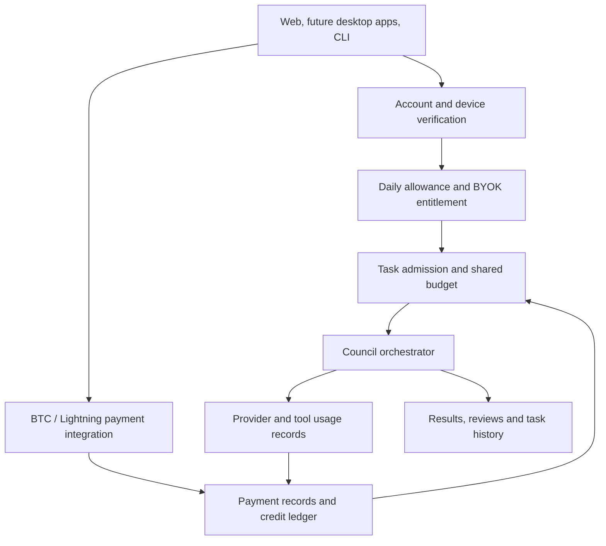

# Planned business architecture

Draft for review, 2026-09-23. **This is a product and architecture plan.**
v0.2.5 has hosted accounts and user-supplied model connections, but no paid
credits, BTC/Lightning settlement, BYOK activation or daily free-task accounting.

## Owner-confirmed contract

| Topic              | Decision                                                                                                   |
| ------------------ | ---------------------------------------------------------------------------------------------------------- |
| Rollout            | Controlled beta with owner and invited testers before broad registration                                   |
| Interfaces         | Responsive browser now; native macOS/Windows/Linux apps later; CLI                                         |
| Account            | Same account across interfaces; CLI will require online account verification                               |
| Free use           | Five tasks per day per account, shared across interfaces                                                   |
| Task definition    | One goal with follow-up messages and one token budget shared by all agents; new goal consumes another task |
| Managed models     | Recharge prepaid credits using BTC or Lightning satoshis; pricing based on token costs, rates undecided    |
| Proceeds           | Owner's wallet; address and payment integration not selected here                                          |
| BYOK               | User supplies keys; one-time activation fee per account across devices and self-hosted installations       |
| Evaluation         | Both quality improvements and efficiency under comparable budgets                                          |
| Database direction | Self-hosted PostgreSQL later; scope/date open                                                              |

No payment amount, provider, wallet address, balance denomination or exchange
rate is established by this document. Provider charges for the user's own keys
are separate from Council's proposed activation fee.

## Proposed component boundaries

The following is an engineering proposal for review, not an implemented schema.

Separate these concepts before extending today's tables:

- **Account/device identity:** owner-scoped credentials, revocation and account
  verification across clients. Self-hosted/offline verification needs its own
  policy; do not silently add a mandatory online dependency to current installs.
- **Product task:** stable identity spanning runs, retries, continuation and
  follow-ups. Today's fresh run budgets cannot reset a future free-task limit.
- **Daily allowance:** atomic admission shared by clients so simultaneous web
  and CLI requests cannot claim the same remaining slot independently.
- **Task budget:** all peer calls, specialists and follow-ups contribute to the
  same usage ceiling. Define input/output/reasoning/cache treatment and unknown
  usage handling before choosing a numerical token cap.
- **BYOK entitlement:** a once-per-account activation record, distinct from
  storing a model key. Activation must not imply Council funds provider calls.
- **Payment record and ledger:** identify a purchase/invoice, verify settlement,
  reconcile retries and only apply a credit once. Do not trust a browser payment
  success message as settlement evidence. Integration-specific rules remain open.
- **Usage records/reservations:** record provider, model, tariff version and
  reported usage. Proposed reservations should bound concurrent spend; actual
  charges and refunds need explicit policies. Do not represent missing usage
  metrics as zero-cost inference.

PostgreSQL is the planned server database direction. A database migration alone
does not provide durable workflows, idempotent external calls or payment
reconciliation; those behaviors need explicit design and failure tests.

## Product boundaries still to decide

| Question                                                                  | Why it matters                                                                   |
| ------------------------------------------------------------------------- | -------------------------------------------------------------------------------- |
| Daily reset timezone vs rolling window                                    | Consistent allowance across clients/timezones                                    |
| Per-task token cap, eligible models and concurrency                       | Controls the actual cost of five free tasks                                      |
| Daily-limit exhaustion and in-progress tasks                              | User must understand when paid credits are used; no silent charge policy assumed |
| Paid credit denomination, tariffs and conversions                         | Token price and BTC payment amount are different quantities                      |
| Failed/retried/cancelled calls and tool costs                             | Defines who pays for unsuccessful work and non-token resources                   |
| BYOK with local Ollama/vLLM or mixed managed/key-backed teams             | Defines activation requirements and which calls consume credits                  |
| Hosted compute/storage included in activation                             | One-time activation does not specify resource allowances                         |
| Account recovery, verification, abuse handling and device revocation      | Daily free use needs reliable account ownership controls                         |
| Self-hosted offline grace, telemetry and entitlement checks               | Must respect the chosen privacy and installation experience                      |
| BTC confirmations, Lightning invoices, expiry, refunds and reconciliation | Requires a selected integration and tested settlement model                      |
| Existing users and sessions                                               | Avoid silently changing access or billing on upgrade                             |

The repository currently carries [MIT licensing](../LICENSE) and native runtime
source is distributed. An account check inside distributed code can be removed
in a modified copy; it is not a technical guarantee that every self-hosted copy
will pay. Official hosted-service entitlements and distribution/licensing policy
need a separate decision. This plan does not change the license or claim
retroactive account/payment restrictions for existing code.

## Delivery and acceptance proposal

1. Finish documentation and fix known recovery defects before broader beta claims.
2. Establish private staging, independent review and owner-approved release gates.
3. Define account/trial policies and test shared allowances with simulated usage.
4. Select payment integration and tariff policy; test duplicate, out-of-order,
   failed and delayed settlement without moving real funds during unit tests.
5. Validate managed usage, BYOK and mixed-team accounting in controlled beta.
6. Build native desktop packaging after common identity/entitlement contracts
   are defined. Choose framework/platform release mechanics separately.

This ordering is a proposal, not a deadline or authorization to deploy. Measure
quality and budget efficiency separately using comparable single-agent tools,
include failures, and publish limitations alongside any eventual results.
